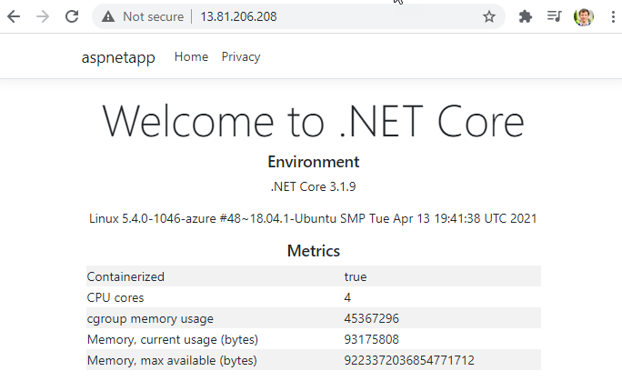
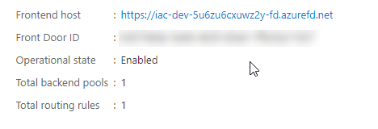

# lab-08 - Implement AKS infrastructure

## Estimated completion time - 15 min

Now that you've learned basics of Bicep, let's implement Immutable AKS infrastructure. Here is what you will implement:


* We will use Azure Front Door to orchestrate the traffic 
* We will use Application Gateway Ingress Controller for Kubernetes ingress
* AKS will be provisioned into it's own VNet 
* AGW will be provisioned to the same VNet, but dedicated `agw` subnet 
* We will provision two (or three) resource groups: `iac-dev-rg`,  `iac-dev-blue-rg` and `iac-dev-green-rg`
* Azure Front Door will be deployed to `iac-dev-rg` resource group 

## Goals

In this lab you will:

* refactor one big Bicep template into two templates with set of modules
* introduce two parameter files, representing two immutable slots
* deploy AKS infrastructure into `blue` slot
* verify that all connectivity is working as expected
* deploy AKS infrastructure into `green` slot
* switch traffic to the new slot

## Task #1 - remove `iac-dev-blue-rg`

First, let's remove all resource we already created by removing `iac-dev-blue-rg` resource group

```bash
# Delete `iac-dev-blue-rg` resource group
az group delete -g iac-dev-blue-rg --yes
```

## Task #2 - create `iac-dev-blue-rg` resource group

```bash
# Create  `iac-dev-blue-rg` resource group
az group create -g iac-dev-blue-rg -l westeurope
```

## Task #3 - deploy AKS infrastructure using one monolithic Bicep template

The [slot.bicep](slot.bicep) Bicep template contains the following resources:

* Network Security Group
* VNet with two subnets 
* Private Public IP address
* Azure Application Gateway
* Azure Kubernetes Service

Let's deploy it to the `iac-dev-blue-rg` resource group

```bash
# Deploy slot.bicep template to iac-dev-blue-rg resource group
az deployment group create -g iac-dev-blue-rg -f slot.bicep
```

Deployment will take between 8-15 min, so you can move on to the next task.

## Task #4 - refactor Bicep template for slot infrastructure

You need to refactor `slot.bicep` template so it fulfills the following requirements:

1. It should request the following input parameters: `environment`, `slot` and `vnetAddressPrefixBase` with `dev`, `blue` and `10.10` as a default values
2. It should create resource group if one doesn't exist
3. It should implement the following modules:
 * `vnet.bicep` - should contain NGS and VNEt resources 
 * `agw.bicep` - should contain Public IP and Application Gateway resources
 * `aks.bicep` - should contain Azure Container Service resource
4. `agw` module depends on `vnet` module
5. `aks` module depends on `vnet` and `agw` modules
6. The "master" Bicep template should be named `infra-slot.bicep`
7. Use `outputs` and `parameters` to send subnet id from `vnet` module to `aks` and `agw` modules
8. Slot specific parameters for `blue` and `green` slots should be implemented as `dev-blue.json` and `dev-green.json` parameter files
9. To review slot infrastructure changes the following command should be used:

```bash
# Review changes 
az deployment sub what-if -f infra-slot.bicep -p dev-blue.json  -l westeurope
```
10. To deploy slot infrastructure changes the following command should be used:

```bash
# Deploy changes
az deployment sub create -f infra-slot.bicep -p dev-blue.json  -l westeurope
```

## Task #4 - enable Application Gateway Ingress Controller (AGIC) and deploy test application

It looks like there is a bug in AKS ARM templates, but it's not possible to implement AGIC add-on using ARM templates or Bicep, therefore we will use `az aks ` command to enable the plugin

```bash
# Get agw resource id
agwId=$(az network application-gateway show -g iac-dev-blue-rg -n iac-dev-blue-aks-agw --query id -otsv)

# Enable ingress-appgw addon
az aks enable-addons -n iac-dev-blue-aks -g iac-dev-blue-rg -a ingress-appgw --appgw-id $agwId

# Get AKS credentials
az aks get-credentials -n iac-dev-blue-aks -g iac-dev-blue-rg --overwrite-existing

# Deploy simple `aspnetapp` app, containing kubernetes pod, service and ingress
kubectl apply -f https://raw.githubusercontent.com/Azure/application-gateway-kubernetes-ingress/master/docs/examples/aspnetapp.yaml

# Check ingress resource 
kubectl get ing -w
NAME        CLASS    HOSTS   ADDRESS         PORTS   AGE
aspnetapp   <none>   *          80      19s
```

Eventually, you should see the public ip address is assigned to the ingress. 
When IP is assigned, try to `curl` it or open it in the browser. 

```bash
# Test that app is up and running and accessible from 
curl http://13.81.206.208/
```

You should see the following page:



## Task #5 - re-create `iac-dev-rg` resource group

Let's delete and create `iac-dev-rg` resource group

```bash
# Delete iac-dev-rg resource group
az group delete -g iac-dev-rg --yes

# Create `iac-dev-rg` resource group
az group create -g iac-dev-rg -l westeurope
```

## Task #6 - deploy Front Door infrastructure using one monolithic Bicep template

The [base.bicep](base.bicep) Bicep template contains the following resources:

* Azure Front Door
* Reference to the Public IP address resource from slot resource group

Let's deploy this template to the `iac-dev-rg` resource group

```bash
# Deploy base.bicep template to iac-dev-rg resource group
az deployment group create -g iac-dev-rg -f base.bicep
```
## Task #7 - refactor Bicep template for base infrastructure

You need to refactor `base.bicep` template so it fulfills the following requirements:

1. It should request the following input parameters: `environment` and `slot` with `dev` and `blue` as a default values
2. It should create resource group if one doesn't exist
3. It should implement the following modules:
 * `fd.bicep` - should contain Azure Front Door resource
 * `acr.bicep` - should contain Azure COntainer Registry resource
4. The "master" Bicep template should be named `infra-base.bicep`
5. To deploy base group infrastructure changes the following command should be used:

```bash
# Deploy changes
az deployment sub create -f infra-base.bicep -p environment=dev -p slot=blue  -l westeurope
```

Normally it takes up to 5 min for Front Door to deploy changes. Eventually, when you navigate to Front Door URL, you should see the same page you got when accessed via Ingress public IP.

You can find URL at the portal (you will have a different URL)




## Task #8 - provision `green` slot 

Make sure that `dev-green.json` file contains correct values for `environment`, `slot` and `vnetAddressPrefixBase` parameters (it should be `dev`, `green` and `10.11`).

Provision the `green` slot using `infra-slot.bicep` template

```bash
# Provision green slot
az deployment sub create -f infra-slot.bicep -p dev-green.json -l westeurope
```

Provisioning takes approx. 10 min.

```bash
# Get agw resource id
agwId=$(az network application-gateway show -g iac-dev-green-rg -n iac-dev-green-aks-agw --query id -otsv)

# Enable ingress-appgw addon
az aks enable-addons -n iac-dev-green-aks -g iac-dev-green-rg -a ingress-appgw --appgw-id $agwId

# Get AKS credentials
az aks get-credentials -n iac-dev-green-aks -g iac-dev-green-rg --overwrite-existing

# Deploy simple sample-app pods
kubectl apply -f https://raw.githubusercontent.com/Azure/application-gateway-kubernetes-ingress/master/docs/examples/sample-app/deployment.yaml

# Deploy simple sample-app service
kubectl apply -f https://raw.githubusercontent.com/Azure/application-gateway-kubernetes-ingress/master/docs/examples/sample-app/service.yaml

# Deploy simple sample-app ingress
kubectl apply -f https://raw.githubusercontent.com/Azure/application-gateway-kubernetes-ingress/master/docs/examples/sample-app/ingress-http.yaml

# Check ingress resource 
kubectl get ing -w
NAME        CLASS    HOSTS   ADDRESS         PORTS   AGE
sample-app   <none>   *          80      19s
sample-app   <none>   *       13.95.211.200   80      19s
```

Eventually, you should see the public ip address is assigned to the ingress. 
When IP is assigned, try to `curl` it or open it in the browser. 

```bash
# Test that app is up and running and accessible from 
curl http://13.95.211.200/
```

You should see the following page:


Now, let's re-configure front door to route traffic to `green` slot.

```bash
# Reconfigure front door towards green slot
az deployment sub create -f infra-base.bicep -p environment=dev -p slot=green -l westeurope
```

Normally it takes up to 5 min for Front Door to deploy changes. Eventually, when you navigate to Front Door URL, you should see the same page you got when accessed via Ingress public IP. Eventually you will see that the page has changed to the one we deployed to `green` slot. 


## Useful links

* [What is Application Gateway Ingress Controller?](https://docs.microsoft.com/en-us/azure/application-gateway/ingress-controller-overview)
* [What is Azure Front Door?](https://docs.microsoft.com/en-us/azure/frontdoor/front-door-overview)
* [Bicep playground](https://bicepdemo.z22.web.core.windows.net/)

## Next: Cleaning up

[Go to lab-09](../lab-09/readme.md)

## Feedback

* Visit the [Github Issue](https://github.com/evgenyb/aks-workshops/issues/33) to comment on this lab. 